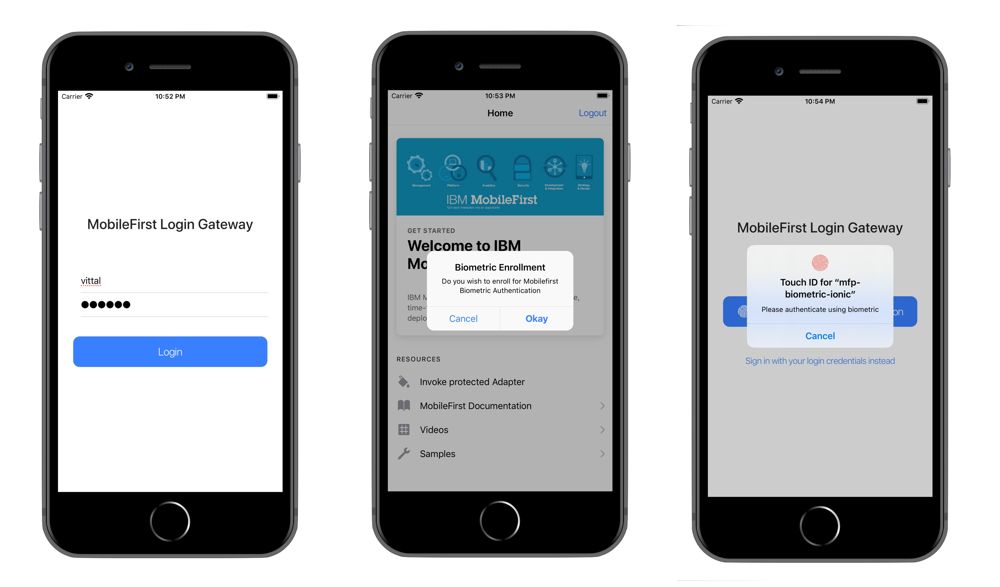

IBM MobileFirst Platform Foundation
===
## MFPBiometricIonic
A sample Ionic 4.x application demonstrating use of the Biometric Validation using Credentials Validation Security Check.

### Usage

1. Use either Maven, MobileFirst CLI or your IDE of choice to [build and deploy the available `ResourceAdapter` and `UserLogin` adapters](https://mobilefirstplatform.ibmcloud.com/tutorials/en/foundation/8.0/adapters/creating-adapters/).

	The UserLogin Security Check and Resource adapter can be found in https://github.com/MobileFirst-Platform-Developer-Center/SecurityCheckAdapters/tree/release80.

2. From a command-line window, navigate to the project's root folder and run the commands:
 - `ionic cordova platform add` - to add a platform.
 - `mfpdev app register` - to register the application.
 - `mfpdev app push` - to map the `accessRestricted` scope to the `UserLogin` security check.
 - `ionic cordova run` - to run the application.

3. Run the application in an Android Emulator, iOS Simulator or Physical device. Login with username and password as `vittal`, You can Enroll for Biometric Authentication for Subsequent Logins.

4. This sample supports both Touch and FaceID Authentication.

### Supported Levels
IBM MobileFirst Platform Foundation 8.0

### License
Copyright 2020 IBM Corp.

Licensed under the Apache License, Version 2.0 (the "License");
you may not use this file except in compliance with the License.
You may obtain a copy of the License at
att
http://www.apache.org/licenses/LICENSE-2.0

Unless required by applicable law or agreed to in writing, software
distributed under the License is distributed on an "AS IS" BASIS,
WITHOUT WARRANTIES OR CONDITIONS OF ANY KIND, either express or implied.
See the License for the specific language governing permissions and
limitations under the License.
